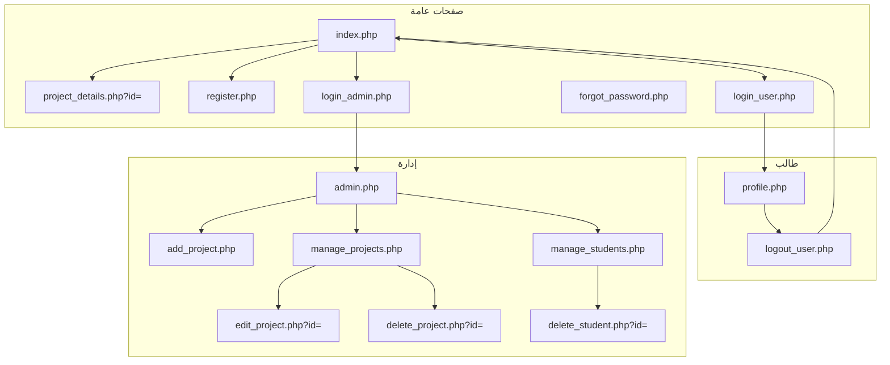
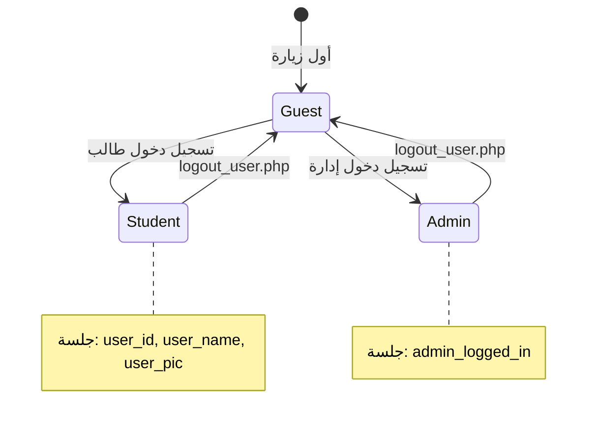
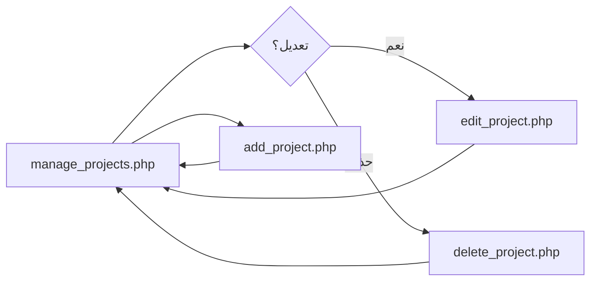
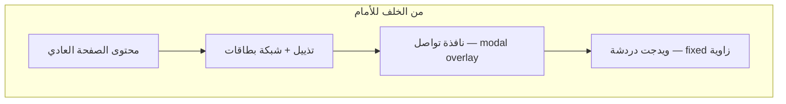
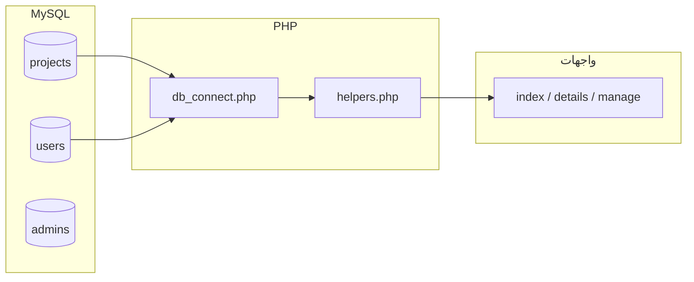

# دليل واجهة منصة مشاريع التخرج — مخططات وسكِتشات

وثيقة مرجعية لـ **هيكل الصفحات** و**مسارات المستخدم** و**طبقات العرض** (ليست لقطات PNG؛ يمكن إرفاق صور لاحقًا في مجلد `docs/screenshots/` وربطها هنا).

**عرض تفاعلي في المتصفح:** افتح [`design_sketches.php`](design_sketches.php) من الرئيسية (زر «سكِتشات التصميم» أو الرابط في التذييل).

| العنصر | المرجع في الكود |
|--------|------------------|
| أنماط عامة | [`style.css`](style.css) |
| دوال مسارات الصور/الملفات | [`helpers.php`](helpers.php) |
| اتصال قاعدة البيانات | [`db_connect.php`](db_connect.php) |

---

## فهرس

1. [مفتاح قراءة السكِتشات](#مفتاح-قراءة-السكِتشات)
2. [جدول الصفحات والجمهور](#جدول-الصفحات-والجمهور)
3. [خريطة الموقع (Mermaid)](#خريطة-الموقع-mermaid)
4. [حالات الجلسة](#حالات-الجلسة)
5. [تدفق الإدارة: مشروع واحد](#تدفق-الإدارة-مشروع-واحد)
6. [مقارنة الهيدر بين الصفحات](#مقارنة-الهيدر-بين-الصفحات)
7. [سكِتشات الشاشات](#سكِتشات-الشاشات)
8. [طبقات ثابتة (دردشة / مودال)](#طبقات-ثابتة-دردشة--مودال)
9. [نموذج بيانات العرض](#نموذج-بيانات-العرض)
10. [قائمة تحقق لاحقًا (لقطات شاشة)](#قائمة-تحقق-لاحقًا-لقطات-شاشة)

---

## مفتاح قراءة السكِتشات

| الرمز | المعنى |
|--------|--------|
| `[_______]` | حقل إدخال |
| `(نص)` | تلميح أو حالة شرطية |
| `┌ ┐ └ ┘ │ ─ ├ ┤` | حدود منطقة |
| `...` | تكرار أو عناصر إضافية |
| `>>` | تدفق RTL منطقي (القراءة من اليمين) |

---

## جدول الصفحات والجمهور

| الملف | الجمهور | الوظيفة الرئيسية |
|--------|---------|-------------------|
| `index.php` | الجميع | استكشاف، بحث، شبكة مشاريع، تذييل، دردشة للمسجّل |
| `project_details.php` | الجميع (جزئيًا يتطلب دخول لبعض السلوك) | تفاصيل مشروع، صور، روابط PDF |
| `register.php` | زائر | تسجيل طالب، شروط، تحقق من كلمة المرور |
| `login_user.php` | زائر | دخول الطالب |
| `forgot_password.php` | زائر | إعادة تعيين كلمة المرور |
| `profile.php` | طالب مسجّل | تحديث الاسم، bio، صورة، كلمة مرور |
| `login_admin.php` | زائر | دخول الإدارة |
| `admin.php` | إدارة | لوحة إحصائيات + Chart.js |
| `add_project.php` | إدارة | إضافة مشروع + رفع ملفات |
| `edit_project.php` | إدارة | تعديل مشروع موجود |
| `manage_projects.php` | إدارة | جدول المشاريع، تعديل/حذف |
| `delete_project.php` | إدارة | حذف (مع تنظيف الملفات المحلية) |
| `manage_students.php` | إدارة | عرض الطلاب |
| `delete_student.php` | إدارة | حذف طالب |
| `logout_user.php` | مسجّل | إنهاء الجلسة |
| `admin_side_bar.php` | — | جزء مضمّن في صفحات الإدارة |
| `chat_api.php` | — | API للدردشة (يُستدعى من الواجهة) |

---

## خريطة الموقع (Mermaid)



---

## حالات الجلسة



---

## تدفق الإدارة: مشروع واحد



---

## مقارنة الهيدر بين الصفحات

| الصفحة | الشعار / العنوان | روابط التنقّل |
|--------|------------------|----------------|
| `index.php` | `logo.png` + رابط «UT \| GradSource» | الرئيسية، دخول طلاب/إدارة أو ملف المستخدم |
| `project_details.php` | نص «أرشيف المشاريع» | الرئيسية |
| `profile.php` | نفس أسلوب `project_details` | الرئيسية، خروج |
| صفحات الإدارة | لا هيدر علوي منفصل؛ **شريط جانبي** | روابط من `admin_side_bar.php` |

---

## سكِتشات الشاشات

### أ) الرئيسية `index.php`

```
┌────────────────────────────────────────────────────────────────────────────┐
│  [logo]  UT | GradSource          ☰    الرئيسية  [دخول طلاب] [دخول إدارة]   │
│            أو: [صورة] الاسم + «تسجيل الخروج»                               │
├────────────────────────────────────────────────────────────────────────────┤
│  ┌──────────────────────────────────────┐ ┌─────────────────────────────┐ │
│  │ عنوان Hero + فقرة دعوة                │ │  صورة توضيحية (pplbg)      │ │
│  │ [بحث________] [قسم ▼] [بحث] [إلغاء]   │ │                             │ │
│  └──────────────────────────────────────┘ └─────────────────────────────┘ │
├────────────────────────────────────────────────────────────────────────────┤
│   ╔══════════╗   ╔══════════╗   ╔══════════╗                                │
│   ║ مشاريع   ║   ║ طلاب     ║   ║ مميزة+   ║   ← شريط إحصاءات            │
│   ╚══════════╝   ╚══════════╝   ╚══════════╝                                │
├────────────────────────────────────────────────────────────────────────────┤
│   ┌──────────┐ ┌──────────┐ ┌──────────┐ ┌──────────┐                      │
│   │ [صورة]   │ │ [صورة]   │ │ [صورة]   │ │ ...      │   ← بطاقات شبكة     │
│   │ قسم | سنة│ │ قسم | سنة│ │ قسم | سنة│ │          │                      │
│   │ عنوان    │ │ عنوان    │ │ عنوان    │ │          │                      │
│   │ ملخص...  │ │ ملخص...  │ │ ملخص...  │ │          │                      │
│   │[تفاصيل]  │ │[تفاصيل]  │ │[تفاصيل]  │ │          │                      │
│   └──────────┘ └──────────┘ └──────────┘ └──────────┘                      │
├────────────────────────────────────────────────────────────────────────────┤
│                         « 1 »  2   3   4  ... »                             │
├────────────────────────────────────────────────────────────────────────────┤
│  [عن المنصة]     [روابط سريعة]     [تواصل]          © السنة               │
└────────────────────────────────────────────────────────────────────────────┘
     الزاوية: ويدجت دردشة (إن وُجدت) + نافذة «تواصل معنا» للمسجّل
```

---

### ب) تفاصيل مشروع `project_details.php`

```
┌────────────────────────────────────────────────────────────────────────────┐
│  أرشيف المشاريع                                    [ الرئيسية ]           │
├────────────────────────────────────────────────────────────────────────────┤
│  عنوان المشروع (H1)                                                        │
│  القسم · سنة التخرج                                                        │
├────────────────────────────────────────────────────────────────────────────┤
│  ┌──────────────────────────────────────────────────────────────────────┐ │
│  │                     صورة رئيسية عريضة                                 │ │
│  └──────────────────────────────────────────────────────────────────────┘ │
│  ┌─ ملخص المشروع ─────────────────────────────────────────────────────┐  │
│  │ فقرات نصية (مع أسطر جديدة)                                            │  │
│  └──────────────────────────────────────────────────────────────────────┘  │
│  ┌─ التقنيات ──────────────────────────────────────────────────────────┐  │
│  │  [وسم] [وسم] [وسم] ...                                                │  │
│  └──────────────────────────────────────────────────────────────────────┘  │
│  (إن وُجد بوستر) ┌─ بوستر ─────────────────────────────────────────────┐   │
│                  │        [صورة بوستر]                                   │   │
│                  └──────────────────────────────────────────────────────┘   │
│  ┌─ ملفات ─────────────────────────────────────────────────────────────┐   │
│  │  [تحميل وثيقة PDF]    [تحميل بوستر PDF]   أو رسالة «لا ملفات»        │   │
│  └──────────────────────────────────────────────────────────────────────┘   │
└────────────────────────────────────────────────────────────────────────────┘
```

---

### ج) تسجيل الطالب `register.php` (هيكل `auth-container`)

```
┌────────────────────────────────────────────────────────────────────────────┐
│  عمود نموذج (يمين)              │  عمود تعريفي / صورة (يسار في RTL)      │
│  ─────────────────────────────  │  ─────────────────────────────────────  │
│  «إنشاء حساب جديد» + subtitle   │  خلفية/صورة تسويقية                      │
│  (تنبيه نجاح/خطأ)               │                                          │
│  [الاسم] [البريد]                │                                          │
│  [كلمة المرور] 👁                 │                                          │
│  [تأكيد المرور] 👁                │                                          │
│  [القسم ▼]                        │                                          │
│  ☐ الشروط والأحكام               │                                          │
│  [ إنشاء الحساب ]                │                                          │
└────────────────────────────────────────────────────────────────────────────┘
```

---

### د) الملف الشخصي `profile.php`

```
┌────────────────────────────────────────────────────────────────────────────┐
│  أرشيف المشاريع                         الرئيسية    |    تسجيل الخروج      │
├────────────────────────────────────────────────────────────────────────────┤
│                         « ملفي الشخصي »                                    │
│                    ┌──────────────┐                                        │
│                    │   صورة دائرية │                                        │
│                    └──────────────┘                                        │
│   تغيير الصورة [اختيار ملف]                                               │
│   الاسم الكامل    [____________________]                                   │
│   نبذة عني        [____________________]                                   │
│                    [____________________]                                   │
│   كلمة مرور جديدة (اختياري) [________]                                     │
│                    [  حفظ التعديلات  ]                                     │
└────────────────────────────────────────────────────────────────────────────┘
```

---

### هـ) تسجيل الدخول (طالب / إدارة)

**طالب — `login_user.php`**

```
        ┌─────────────────────────────┐
        │   تسجيل دخول الطلاب       │
        │   (رسالة خطأ حمراء)       │
        │   البريد    [__________]  │
        │   المرور    [__________]  │
        │   [====== دخول ======]    │
        │ نسيت المرور؟    إنشاء حساب│
        └─────────────────────────────┘
```

**إدارة — `login_admin.php`**

```
        ┌─────────────────────────────┐
        │   تسجيل دخول الإدارة      │
        │   [صندوق تنبيه ملوّن]     │
        │   المستخدم  [__________]  │
        │   المرور    [__________]  │
        │   [== تسجيل الدخول ==]    │
        │      العودة للرئيسية      │
        └─────────────────────────────┘
```

---

### و) لوحة الإدارة — هيكل مشترك

```
┌───────────────┬────────────────────────────────────────────────────────────┐
│ لوحة التحكم   │  شريط علوي: «مرحباً بك، مدير النظام»                       │
│───────────────│────────────────────────────────────────────────────────────│
│ الرئيسية      │  ┌─────────┐ ┌─────────┐ ┌─────────┐                         │
│ إضافة مشروع   │  │ مشاريع  │ │ طلاب   │ │ أقسام   │  ← بطاقات أرقام        │
│ إدارة المشاريع│  └─────────┘ └─────────┘ └─────────┘                         │
│ إدارة الطلاب  │  ┌─────────────────────┐ ┌─────────────────────┐             │
│ تسجيل الخروج  │  │ Chart: حسب القسم    │ │ Chart: حسب السنة   │  ← admin.php│
│               │  └─────────────────────┘ └─────────────────────┘             │
│               │  (في صفحات أخرى: جداول أو نماذج طويلة بدل الرسوم)          │
└───────────────┴────────────────────────────────────────────────────────────┘
```

**إضافة مشروع `add_project.php`** (مبسّط): عنوان، وصف، قسم، سنة، تقنيات، حقول رفع (صورة مشروع، بوستر، PDF، PDF بوستر)، زر حفظ.

**تعديل مشروع `edit_project.php`**: نفس الحقول + معاينة للصور/الملفات الحالية.

**إدارة المشاريع `manage_projects.php`**: جدول بصف لكل مشروع (صورة مصغّرة، عنوان، قسم، سنة، أزرار تعديل/حذف).

---

## طبقات ثابتة (دردشة / مودال)



في `index.php`: الدردشة والمودال مضمّنان مع أنماط `<style>` داخل الصفحة؛ يبقيان فوق المحتوى عند التمرير.

---

## نموذج بيانات العرض



- **`projects.image_url`**: إما اسم ملف تحت `uploads/` أو URL يبدأ بـ `http(s)://` — يمر عبر `helpers.php`.

---

## قائمة تحقق لاحقًا (لقطات شاشة)

عند إضافة مجلد `docs/screenshots/` يُنصح بالتقط التالي (سطح مكتب + جوال):

1. `index.png` — الهيدر + Hero + صف من بطاقات.
2. `index-mobile.png` — قائمة ☰ مفتوحة.
3. `project-details.png` — صورة كبيرة + أقسام نصية.
4. `login-user.png` / `login-admin.png`.
5. `register.png` — النموذج كاملًا.
6. `profile.png`.
7. `admin-dashboard.png` — الإحصائيات + الرسوم.
8. `manage-projects.png` — الجدول.
9. `add-project.png` — أعلى النموذج.

ثم أضف في أعلى هذا الملف قسمًا:

```markdown
## لقطات شاشة

```

---

*آخر مراجعة تتوافق مع هيكل المستودع الحالي (`helpers.php`, شبكة المشاريع، لوحة الإدارة).*
