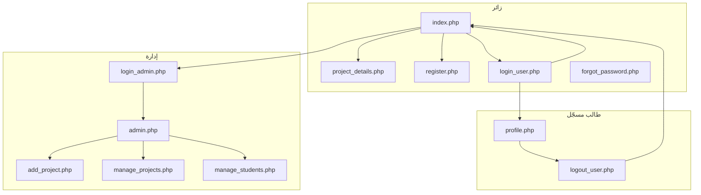
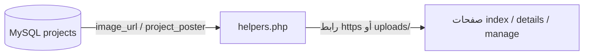

# سكِتشات ومخططات صفحات منصة مشاريع التخرج

الواجهة **عربية RTL**، الأنماط في [`style.css`](style.css). أدناه مخططات تدفق وبنيات شاشة (wireframes نصية) — ليست لقطات شاشة فعلية، بل تمثيل هيكل الصفحة كما في الكود.

---

## 1) خريطة الملفات ↔ الصفحات

| الملف | الدور |
|--------|--------|
| `index.php` | الرئيسية: بحث، شبكة مشاريع، تذييل، دردشة (إن وُجدت) |
| `project_details.php?id=` | تفاصيل مشروع واحد |
| `login_user.php` / `register.php` / `forgot_password.php` | طالب: دخول، تسجيل، استعادة كلمة المرور |
| `profile.php` | ملف الطالب |
| `login_admin.php` | دخول الإدارة |
| `admin.php` | لوحة إدارة: إحصائيات + رسوم Chart.js |
| `admin_side_bar.php` | شريط جانبي مضمّن في صفحات الإدارة |
| `add_project.php` / `edit_project.php` / `manage_projects.php` / `delete_project.php` | إدارة المشاريع |
| `manage_students.php` / `delete_student.php` | إدارة الطلاب |

---

## 2) تدفّق التنقّل (زائر / طالب / إدارة)



---

## 3) الرئيسية `index.php` — سكِتش RTL (من اليمين لليسار منطقياً)

```
┌─────────────────────────────────────────────────────────────────────────┐
│  [شعار] UT | GradSource          ☰    الرئيسية | دخول طلاب | دخول إدارة │
│            (أو: صورة المستخدم + الاسم + خروج إن مسجّل)                  │
├─────────────────────────────────────────────────────────────────────────┤
│                         قسم Hero (نص + بحث)          │   صورة pplbg     │
│   عنوان + فقرة + [حقل بحث] [قائمة أقسام] [بحث] [إلغاء]                  │
├─────────────────────────────────────────────────────────────────────────┤
│   [إحصاء: عدد مشاريع]  [عدد طلاب]  [مشاريع مميزة+]                       │
├─────────────────────────────────────────────────────────────────────────┤
│  ┌─────────┐  ┌─────────┐  ┌─────────┐  ... (شبكة بطاقات)               │
│  │ صورة    │  │ صورة    │  │ صورة    │                                   │
│  │ قسم سنة │  │ قسم سنة │  │ قسم سنة │                                   │
│  │ عنوان   │  │ عنوان   │  │ عنوان   │                                   │
│  │ وصف مختصر│ │ وصف مختصر│ │ وصف مختصر│                                  │
│  │[عرض التفاصيل]│ ...    │  │         │                                   │
│  └─────────┘  └─────────┘  └─────────┘                                   │
├─────────────────────────────────────────────────────────────────────────┤
│                    ترقيم صفحات [1] [2] [3] ...                           │
├─────────────────────────────────────────────────────────────────────────┤
│  تذييل: 3 أعمدة (عن المنصة | روابط | تواصل) + حقوق                      │
└─────────────────────────────────────────────────────────────────────────┘
        (قد يظهر زر/نافذة «تواصل معنا» للمستخدم المسجّل + ويدجت دردشة)
```

---

## 4) تسجيل دخول الطالب `login_user.php`

```
┌──────────────────────────┐
│   تسجيل دخول الطلاب      │
│   (رسالة خطأ إن وُجدت)   │
│                          │
│   البريد الإلكتروني      │
│   [________________]     │
│   كلمة المرور            │
│   [________________]     │
│   [      دخول      ]     │
│   نسيت كلمة المرور؟ | إنشاء حساب │
└──────────────────────────┘
```

---

## 5) تسجيل دخول الإدارة `login_admin.php`

```
┌──────────────────────────┐
│   تسجيل دخول الإدارة     │
│   (صندوق تنبيه أحمر)     │
│   اسم المستخدم           │
│   [________________]     │
│   كلمة المرور            │
│   [________________]     │
│   [   تسجيل الدخول  ]    │
│   العودة للرئيسية        │
└──────────────────────────┘
```

---

## 6) لوحة الإدارة `admin.php` — تخطيط Sidebar + محتوى

```
┌──────────────┬──────────────────────────────────────────────────┐
│ لوحة التحكم  │  مرحباً بك، مدير النظام                          │
│──────────────┤──────────────────────────────────────────────────┤
│ الرئيسية     │  ┌──────────┐ ┌──────────┐ ┌──────────┐          │
│ إضافة مشروع  │  │إجمالي    │ │إجمالي    │ │أقسام     │          │
│ إدارة المشاريع│ │مشاريع    │ │طلاب      │ │مسجّلة   │          │
│ إدارة الطلاب │  └──────────┘ └──────────┘ └──────────┘          │
│ تسجيل الخروج │  ┌────────────────────┐ ┌────────────────────┐   │
│              │  │ مشاريع حسب القسم   │ │ مشاريع حسب السنة   │   │
│              │  │   (Chart.js)       │ │   (Chart.js)       │   │
│              │  └────────────────────┘ └────────────────────┘   │
└──────────────┴──────────────────────────────────────────────────┘
```

نفس الشريط الجانبي يُعاد استخدامه في: `add_project.php`, `edit_project.php`, `manage_projects.php`, `manage_students.php` عبر `admin_side_bar.php`.

---

## 7) تفاصيل المشروع `project_details.php`

```
┌─────────────────────────────────────────────────────────┐
│  أرشيف المشاريع                    [الرئيسية]            │
├─────────────────────────────────────────────────────────┤
│  عنوان المشروع (H1)                                     │
│  القسم | سنة التخرج                                     │
├─────────────────────────────────────────────────────────┤
│  ┌─────────────────────────────────────────────────┐   │
│  │        صورة رئيسية كبيرة (معرض)                 │   │
│  └─────────────────────────────────────────────────┘   │
│  ملخص المشروع (نص)                                      │
│  التقنيات المستخدمة [وسم] [وسم] ...                     │
│  (اختياري) بوستر المشروع — صورة                          │
│  ملفات المشروع: [تحميل PDF توثيق] [تحميل PDF بوستر]    │
└─────────────────────────────────────────────────────────┘
```

---

## 8) إدارة المشاريع `manage_projects.php` (مبسّط)

```
┌──────────────┬──────────────────────────────────────────────┐
│ (نفس الشريط)│  عنوان الصفحة + عدد المشاريع                 │
│              │  ┌────────────────────────────────────────┐  │
│              │  │ جدول: صورة مصغّرة | عنوان | قسم | سنة │  │
│              │  │        [تعديل] [حذف]                   │  │
│              │  └────────────────────────────────────────┘  │
└──────────────┴──────────────────────────────────────────────┘
```

---

## 9) علاقة البيانات مع العرض (صور المشاريع)



- إذا كانت القيمة تبدأ بـ `http://` أو `https://` تُستخدم كرابط مباشر.
- وإلا تُعرض تحت المسار `uploads/...`.

---

## 10) ملاحظات للمصمّم أو المطوّر

- **الهيدر** في `index.php` يختلف قليلاً عن `project_details.php` (شعار مختلف / نص «أرشيف المشاريع»).
- **الدردشة** والمودال في `index.php` مضمّنان في نفس الملف (أنماط داخلية + سكربت).
- صفحات الإدارة تعتمد `body.admin-body` و`.admin-layout` من `style.css`.

---

*آخر تحديث يتبع هيكل المستودع الحالي.*
